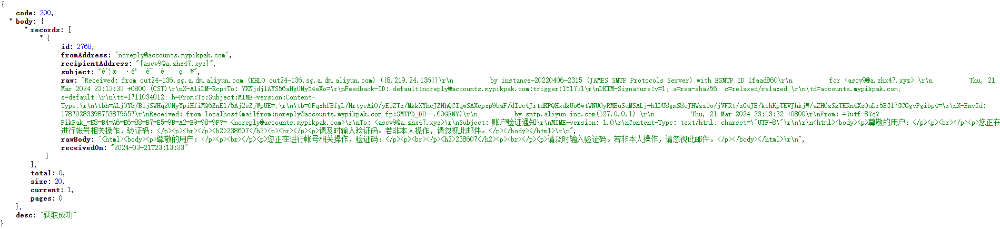
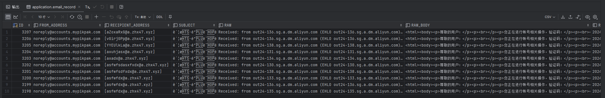

通过 `james` 的 `MessageHook` 的垃圾邮箱。

**仅保存文本内容，附件会进行丢弃**

默认占用两个端口，10025进行邮件的获取，25进行接收 SMTP 邮件，可自行更改；

首先搞几个域名MX解析到服务器上面，不需要提前创建邮箱，来者不拒全部接收。

默认使用MySQL进行持久化存储

```sql
CREATE TABLE `email_record` (
  `ID` bigint NOT NULL AUTO_INCREMENT,
  `FROM_ADDRESS` varchar(255) CHARACTER SET utf8mb4 COLLATE utf8mb4_0900_ai_ci NOT NULL,
  `RECIPIENT_ADDRESS` varchar(255) NOT NULL,
  `SUBJECT` longtext CHARACTER SET utf8mb4 COLLATE utf8mb4_0900_ai_ci NOT NULL,
  `RAW` longtext CHARACTER SET utf8mb4 COLLATE utf8mb4_0900_ai_ci NOT NULL,
  `RAW_BODY` longtext CHARACTER SET utf8mb4 COLLATE utf8mb4_0900_ai_ci NOT NULL,
  `RECEIVED_ON` timestamp NULL DEFAULT NULL,
  PRIMARY KEY (`ID`) USING BTREE
) ENGINE=InnoDB AUTO_INCREMENT=1 DEFAULT CHARSET=utf8mb4 COLLATE=utf8mb4_0900_ai_ci ROW_FORMAT=DYNAMIC
```

获取接口 `GET http://127.0.0.1:10025/crazeMail/email/${temp_email}`



